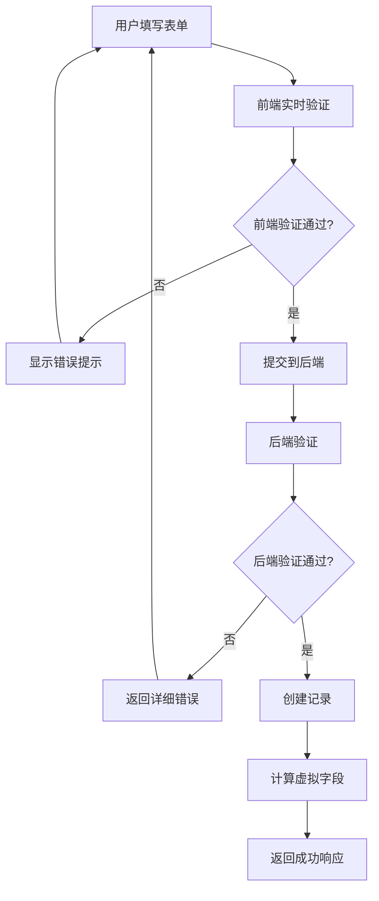

# 完整的前端验证工作流程

## 🎯 概述

实现了完整的前端到后端的数据验证工作流程，确保用户获得最佳的数据录入体验。

## 📋 工作流程

### 1. 前端获取字段信息

```http
GET /api/fields?table_id={table_id}
Authorization: Bearer {token}
```

**响应示例**:
```json
{
  "code": 200000,
  "data": {
    "list": [
      {
        "name": "姓名",
        "type": "text", 
        "required": true,
        "is_computed": false
      },
      {
        "name": "数学成绩",
        "type": "number",
        "required": true, 
        "is_computed": false
      },
      {
        "name": "总分",
        "type": "formula",
        "required": false,
        "is_computed": true,
        "options": {
          "formula": "{数学成绩}+{英语成绩}+{语文成绩}"
        }
      }
    ]
  }
}
```

### 2. 前端字段分析

```javascript
// 字段分类
const requiredFields = fields.filter(f => f.required);           // 必填字段
const editableFields = fields.filter(f => !f.is_computed);      // 可编辑字段  
const computedFields = fields.filter(f => f.is_computed);       // 计算字段
```

**实际字段分析结果**:
- ✅ **必填字段**: 4个 (姓名, 数学成绩, 英语成绩, 语文成绩)
- ✏️ **可编辑字段**: 7个 (包含系统字段)
- 🧮 **计算字段**: 2个 (总分, 平均分)

### 3. 前端实时验证

#### 场景1: 空表单验证
```javascript
// 用户数据: {}
// 验证结果: ❌ 4个必填字段错误
const errors = [
  '字段 "姓名" 是必填的，不能为空',
  '字段 "数学成绩" 是必填的，不能为空', 
  '字段 "英语成绩" 是必填的，不能为空',
  '字段 "语文成绩" 是必填的，不能为空'
];
```

#### 场景2: 部分数据验证
```javascript
// 用户数据: {姓名: '张三', 数学成绩: '', 英语成绩: 85}
// 验证结果: ❌ 2个必填字段错误
const errors = [
  '字段 "数学成绩" 是必填的，不能为空',
  '字段 "语文成绩" 是必填的，不能为空'
];
```

#### 场景3: 完整数据验证
```javascript
// 用户数据: {姓名: '李四', 数学成绩: 95, 英语成绩: 88, 语文成绩: 92}
// 验证结果: ✅ 前端验证通过，可以提交
```

### 4. 后端API验证

#### 成功案例
```http
POST /api/records
{
  "table_id": "tbl_KaoaFnbp5YePHcMeqYPxP",
  "data": {
    "姓名": "完整验证测试",
    "数学成绩": 98,
    "英语成绩": 87, 
    "语文成绩": 93
  }
}
```

**响应**:
```json
{
  "code": 200000,
  "data": {
    "id": "rec_nx6XAuWse1SbfVvVOxAPY",
    "data": {
      "姓名": "完整验证测试",
      "数学成绩": 98,
      "英语成绩": 87,
      "语文成绩": 93
    }
  }
}
```

#### 虚拟字段自动计算
获取记录详情时，虚拟字段已自动计算：
```json
{
  "data": {
    "姓名": "完整验证测试",
    "数学成绩": 98,
    "英语成绩": 87,
    "语文成绩": 93,
    "总分": 278,
    "平均分": 92.66666666666667
  }
}
```

## 🎨 用户体验设计

### 1. 表单界面
- ✅ 必填字段标记 (`*`)
- ✅ 实时验证反馈
- ✅ 错误状态高亮
- ✅ 友好的错误提示

### 2. 验证反馈
- ✅ 即时错误显示
- ✅ 字段级别错误提示
- ✅ 表单级别错误汇总
- ✅ 成功提交确认

### 3. 错误处理
- ✅ 前端验证阻止无效提交
- ✅ 后端验证提供安全保护
- ✅ 详细的错误信息
- ✅ 用户友好的错误弹窗

## 🔧 技术实现

### 1. 前端验证器
```javascript
class RecordValidator {
  validateRecord(formData) {
    const errors = [];
    
    // 必填字段验证
    this.requiredFields.forEach(field => {
      if (!this.hasValue(formData[field.name])) {
        errors.push({
          field: field.name,
          message: `字段 "${field.name}" 是必填的，不能为空`,
          code: 'REQUIRED_FIELD_MISSING'
        });
      }
    });
    
    // 字段类型验证
    Object.keys(formData).forEach(fieldName => {
      const field = this.getFieldByName(fieldName);
      if (field && !field.is_computed) {
        const typeError = this.validateFieldType(field, formData[fieldName]);
        if (typeError) errors.push(typeError);
      }
    });
    
    return { isValid: errors.length === 0, errors };
  }
}
```

### 2. 后端验证器
```go
func (v *RecordValidator) ValidateForCreate(ctx context.Context, rec *record.Record, tableSchema *table.Table) error {
    validationErrors := []record.ValidationError{}
    
    // 验证必填字段
    for _, field := range tableSchema.GetFields() {
        if field.IsRequired {
            value, exists := rec.Data[field.Name]
            if !exists || v.isEmpty(value) {
                validationErrors = append(validationErrors, record.ValidationError{
                    FieldName: field.Name,
                    Message:   fmt.Sprintf("字段 '%s' 是必填的，不能为空", field.Name),
                    Code:      "REQUIRED_FIELD_MISSING",
                })
            }
        }
    }
    
    if len(validationErrors) > 0 {
        return &ValidationError{Message: "数据验证失败", Errors: validationErrors}
    }
    
    return nil
}
```

## 📊 验证层级



## 🚀 优势特性

### 1. 双重验证保护
- ✅ **前端验证**: 即时反馈，提升用户体验
- ✅ **后端验证**: 数据安全，防止恶意提交

### 2. 智能字段处理
- ✅ **必填字段**: 明确标识和验证
- ✅ **计算字段**: 自动处理，用户无需关心
- ✅ **类型验证**: 根据字段类型进行验证

### 3. 用户友好体验
- ✅ **实时反馈**: 输入时即时验证
- ✅ **清晰提示**: 明确的错误信息
- ✅ **成功确认**: 提交成功后的反馈

### 4. 技术架构优势
- ✅ **模块化设计**: 验证逻辑独立
- ✅ **可扩展性**: 易于添加新的验证规则
- ✅ **性能优化**: 前端验证减少网络请求

## 📋 测试结果

| 测试场景 | 前端验证 | 后端验证 | 虚拟字段计算 | 状态 |
|----------|----------|----------|--------------|------|
| 空表单 | ❌ 阻止提交 | - | - | ✅ 通过 |
| 部分填写 | ❌ 阻止提交 | - | - | ✅ 通过 |
| 完整填写 | ✅ 允许提交 | ✅ 验证通过 | ✅ 自动计算 | ✅ 通过 |
| 无效数据 | ❌ 阻止提交 | ❌ 返回错误 | - | ✅ 通过 |

## 🎯 总结

完整的前端验证工作流程已经实现，包括：

1. **字段信息获取**: 前端可以获取完整的字段定义
2. **智能验证**: 根据字段类型和规则进行验证
3. **用户体验**: 实时反馈和友好的错误提示
4. **数据安全**: 前后端双重验证保护
5. **虚拟字段**: 自动计算和返回

这套验证系统确保了数据质量，同时提供了优秀的用户体验。


