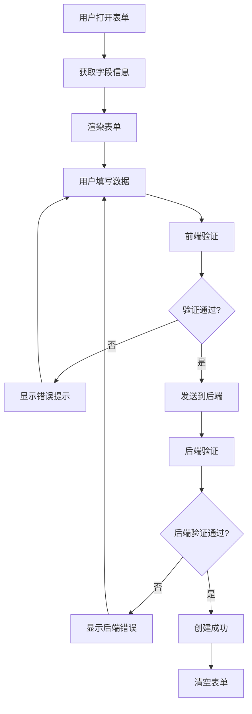

# 前端数据验证指南

## 🎯 概述

前端应该先获取表的字段信息，进行客户端验证，然后才向后端发送请求。这样可以提供更好的用户体验，减少不必要的网络请求。

## 📋 字段信息获取

### 1. API 端点

```http
GET /api/fields?table_id={table_id}
Authorization: Bearer {token}
```

### 2. 响应格式

```json
{
  "code": 200000,
  "data": {
    "list": [
      {
        "id": "fld_7qe84AAhn5MSZWIrwFmEW",
        "name": "姓名",
        "type": "text",
        "required": true,
        "is_computed": false,
        "description": null,
        "options": null
      },
      {
        "id": "fld_ZeOg3SOndFxE3dMY4mMAU", 
        "name": "数学成绩",
        "type": "number",
        "required": true,
        "is_computed": false,
        "description": null,
        "options": null
      },
      {
        "id": "fld_xpAbo9Iq140JqymQvXFNG",
        "name": "总分",
        "type": "formula",
        "required": false,
        "is_computed": true,
        "description": null,
        "options": {
          "formula": "{数学成绩}+{英语成绩}+{语文成绩}"
        }
      }
    ],
    "pagination": {
      "total": 9
    }
  }
}
```

## 🔧 前端验证实现

### 1. 字段信息缓存

```javascript
class TableFieldManager {
  constructor() {
    this.fields = new Map();
    this.fieldConfig = new Map();
  }

  async loadFields(tableId) {
    try {
      const response = await fetch(`/api/fields?table_id=${tableId}`, {
        headers: {
          'Authorization': `Bearer ${getToken()}`
        }
      });
      
      const data = await response.json();
      if (data.code === 200000) {
        this.processFields(data.data.list);
        return true;
      }
      return false;
    } catch (error) {
      console.error('加载字段信息失败:', error);
      return false;
    }
  }

  processFields(fields) {
    fields.forEach(field => {
      this.fields.set(field.name, field);
      this.fieldConfig.set(field.id, field);
    });
  }

  getFieldByName(name) {
    return this.fields.get(name);
  }

  getRequiredFields() {
    return Array.from(this.fields.values()).filter(field => field.required);
  }

  getEditableFields() {
    return Array.from(this.fields.values()).filter(field => !field.is_computed);
  }
}
```

### 2. 数据验证器

```javascript
class RecordValidator {
  constructor(fieldManager) {
    this.fieldManager = fieldManager;
  }

  validateRecord(recordData) {
    const errors = [];
    const requiredFields = this.fieldManager.getRequiredFields();
    
    // 验证必填字段
    requiredFields.forEach(field => {
      const value = recordData[field.name];
      if (!this.hasValue(value)) {
        errors.push({
          field: field.name,
          message: `字段 "${field.name}" 是必填的，不能为空`,
          code: 'REQUIRED_FIELD_MISSING'
        });
      }
    });

    // 验证字段类型
    Object.keys(recordData).forEach(fieldName => {
      const field = this.fieldManager.getFieldByName(fieldName);
      if (field && !field.is_computed) {
        const value = recordData[fieldName];
        if (this.hasValue(value)) {
          const typeError = this.validateFieldType(field, value);
          if (typeError) {
            errors.push(typeError);
          }
        }
      }
    });

    // 过滤掉计算字段
    const editableFields = this.fieldManager.getEditableFields();
    Object.keys(recordData).forEach(fieldName => {
      const field = this.fieldManager.getFieldByName(fieldName);
      if (!field) {
        errors.push({
          field: fieldName,
          message: `未知字段 "${fieldName}"`,
          code: 'UNKNOWN_FIELD'
        });
      }
    });

    return {
      isValid: errors.length === 0,
      errors: errors
    };
  }

  hasValue(value) {
    return value !== null && value !== undefined && value !== '';
  }

  validateFieldType(field, value) {
    switch (field.type) {
      case 'number':
        if (isNaN(Number(value))) {
          return {
            field: field.name,
            message: `字段 "${field.name}" 必须是数字`,
            code: 'INVALID_NUMBER'
          };
        }
        break;
      
      case 'text':
        if (typeof value !== 'string') {
          return {
            field: field.name,
            message: `字段 "${field.name}" 必须是文本`,
            code: 'INVALID_TEXT'
          };
        }
        break;
      
      case 'select':
        // 验证选择字段的值是否在选项中
        if (field.options && field.options.choices) {
          const validValues = field.options.choices.map(choice => choice.value);
          if (!validValues.includes(value)) {
            return {
              field: field.name,
              message: `字段 "${field.name}" 的值不在可选范围内`,
              code: 'INVALID_SELECT_VALUE'
            };
          }
        }
        break;
    }
    
    return null;
  }
}
```

### 3. 表单组件

```javascript
class RecordForm {
  constructor(tableId, fieldManager, validator) {
    this.tableId = tableId;
    this.fieldManager = fieldManager;
    this.validator = validator;
    this.formData = {};
  }

  async init() {
    const success = await this.fieldManager.loadFields(this.tableId);
    if (success) {
      this.renderForm();
    } else {
      this.showError('加载字段信息失败');
    }
  }

  renderForm() {
    const editableFields = this.fieldManager.getEditableFields();
    const formContainer = document.getElementById('record-form');
    
    formContainer.innerHTML = '';
    
    editableFields.forEach(field => {
      const fieldElement = this.createFieldElement(field);
      formContainer.appendChild(fieldElement);
    });
  }

  createFieldElement(field) {
    const div = document.createElement('div');
    div.className = 'field-container';
    
    const label = document.createElement('label');
    label.textContent = field.name;
    if (field.required) {
      label.textContent += ' *';
      label.className = 'required';
    }
    
    let input;
    switch (field.type) {
      case 'text':
        input = document.createElement('input');
        input.type = 'text';
        break;
        
      case 'number':
        input = document.createElement('input');
        input.type = 'number';
        break;
        
      case 'select':
        input = document.createElement('select');
        if (field.options && field.options.choices) {
          field.options.choices.forEach(choice => {
            const option = document.createElement('option');
            option.value = choice.value;
            option.textContent = choice.label || choice.value;
            input.appendChild(option);
          });
        }
        break;
    }
    
    input.name = field.name;
    input.addEventListener('input', (e) => {
      this.formData[field.name] = e.target.value;
    });
    
    div.appendChild(label);
    div.appendChild(input);
    return div;
  }

  async submitRecord() {
    // 前端验证
    const validation = this.validator.validateRecord(this.formData);
    if (!validation.isValid) {
      this.showValidationErrors(validation.errors);
      return;
    }

    // 发送到后端
    try {
      const response = await fetch('/api/records', {
        method: 'POST',
        headers: {
          'Content-Type': 'application/json',
          'Authorization': `Bearer ${getToken()}`
        },
        body: JSON.stringify({
          table_id: this.tableId,
          data: this.formData
        })
      });

      const result = await response.json();
      if (result.code === 200000) {
        this.showSuccess('记录创建成功');
        this.clearForm();
      } else {
        this.showError(result.error.details);
      }
    } catch (error) {
      this.showError('网络错误: ' + error.message);
    }
  }

  showValidationErrors(errors) {
    const errorMessages = errors.map(error => error.message);
    this.showError(errorMessages.join('\n'));
  }

  showError(message) {
    // 显示错误弹窗
    const errorDialog = document.createElement('div');
    errorDialog.className = 'error-dialog';
    errorDialog.innerHTML = `
      <div class="error-content">
        <div class="error-icon">⚠️</div>
        <div class="error-title">数据校验错误</div>
        <div class="error-message">${message}</div>
        <button onclick="this.parentElement.parentElement.remove()">确定</button>
      </div>
    `;
    document.body.appendChild(errorDialog);
  }

  showSuccess(message) {
    // 显示成功提示
    console.log('✅', message);
  }

  clearForm() {
    this.formData = {};
    document.getElementById('record-form').reset();
  }
}
```

### 4. 使用示例

```javascript
// 初始化表单
const fieldManager = new TableFieldManager();
const validator = new RecordValidator(fieldManager);
const recordForm = new RecordForm('tbl_KaoaFnbp5YePHcMeqYPxP', fieldManager, validator);

// 加载字段信息并渲染表单
recordForm.init();

// 提交记录
document.getElementById('submit-btn').addEventListener('click', () => {
  recordForm.submitRecord();
});
```

## 🎨 用户体验优化

### 1. 实时验证

```javascript
// 为输入框添加实时验证
input.addEventListener('blur', (e) => {
  const field = this.fieldManager.getFieldByName(e.target.name);
  const validation = this.validateSingleField(field, e.target.value);
  if (!validation.isValid) {
    this.showFieldError(e.target, validation.errors[0].message);
  } else {
    this.clearFieldError(e.target);
  }
});
```

### 2. 必填字段标识

```css
.required {
  color: #ef4444;
  font-weight: bold;
}

.field-error {
  border-color: #ef4444;
  box-shadow: 0 0 0 1px #ef4444;
}

.error-message {
  color: #ef4444;
  font-size: 12px;
  margin-top: 4px;
}
```

### 3. 错误提示样式

```css
.error-dialog {
  position: fixed;
  top: 0;
  left: 0;
  right: 0;
  bottom: 0;
  background: rgba(0, 0, 0, 0.5);
  display: flex;
  align-items: center;
  justify-content: center;
  z-index: 1000;
}

.error-content {
  background: white;
  padding: 24px;
  border-radius: 8px;
  max-width: 400px;
  text-align: center;
}

.error-icon {
  font-size: 48px;
  margin-bottom: 16px;
}

.error-title {
  font-size: 18px;
  font-weight: bold;
  color: #ef4444;
  margin-bottom: 12px;
}

.error-message {
  color: #374151;
  margin-bottom: 20px;
  line-height: 1.5;
}
```

## 📊 验证流程



## 🚀 优势

1. **更好的用户体验**: 实时验证，即时反馈
2. **减少网络请求**: 前端验证过滤明显错误
3. **清晰的错误提示**: 明确指出哪个字段有问题
4. **类型安全**: 根据字段类型进行验证
5. **可扩展**: 易于添加新的验证规则

## 📋 字段类型验证规则

| 字段类型 | 验证规则 | 错误提示 |
|----------|----------|----------|
| text | 非空字符串 | 必须是文本 |
| number | 有效数字 | 必须是数字 |
| select | 值在选项中 | 值不在可选范围内 |
| date | 有效日期格式 | 必须是有效日期 |
| formula | 跳过验证 | 计算字段不验证 |

这样的前端验证机制可以大大提升用户体验，让用户在提交前就知道哪些字段需要修正。


